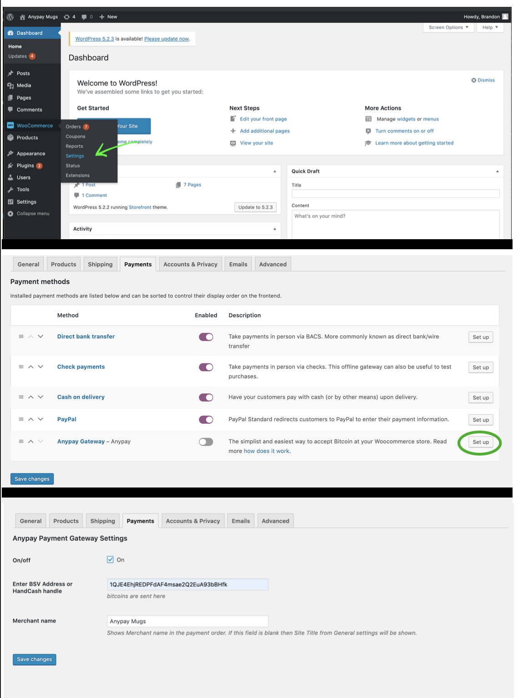
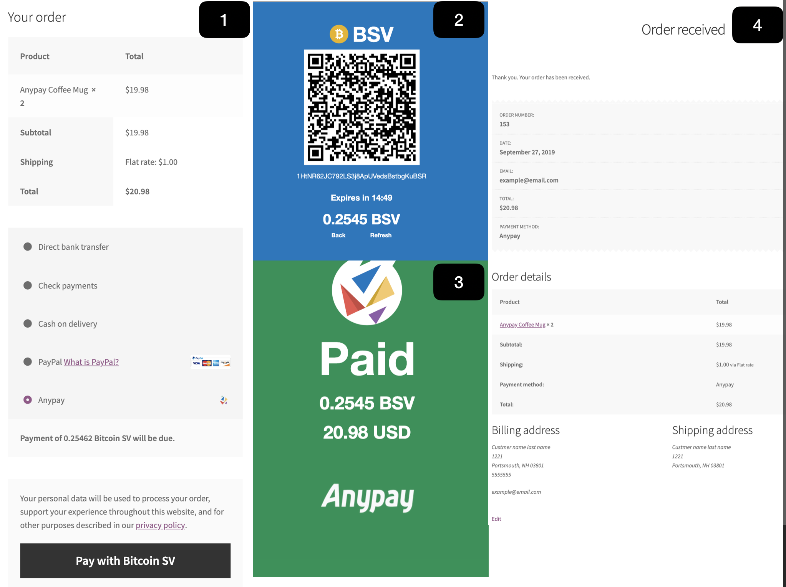

# About Anypay 

Founded back in 2015, Anypay has been a trusted industry leader in cryptocurrency payments for years; serving hundreds of businesses around the world. The experienced team is great at helping store owners new to Bitcoin understand and use it to improve their business.      

# WooCommerce Plugin

Anypay Payment Gateway is a custom WooCommerce plugin that is powered by Anypay's reliable payments API that makes it incredibly simple easy to start accepting BitcoinSV at your online store.

# How does it work?

* The Buyer prepares the order and clicks on the "proceed to Anypay" button.

* The Buyer is redirected to the invoice 

* The Buyer pays the invoice with their wallet 

* The Bitcoin is sent directly to the business owners Bitcoin Wallet

* The Buyer is redirected to the receipts page and the order is set to "Processing"

# Manual Installation 

* This plugin requires WooCommerce to be installed and activated, <https://docs.woocommerce.com/document/installing-uninstalling-woocommerce/>

* Download the plugin file from here <https://raw.githubusercontent.com/anypay/WooCommerce/master/trunk/anypay_woocommerce.php> 

  - `curl https://raw.githubusercontent.com/anypay/WooCommerce/master/trunk/anypay_woocommerce.php > anypay_woocommerce.php` 

* Place this file into the plugins folder of your WordPress site `wordpress-html/wp-content/plugins/anypay_woocommerce.php`

# Set up 

* Now in your WordPress Admin Dashboard, Enter your BSV address into the Anypay Gateway Settings: `Admin -> WooCommerce -> Settings -> Payments Tab -> Anypay Gateway`

# Customer Checkout Flow 

# Support 

Please reach out to <support@anypayinc.com> for assistance or any questions

